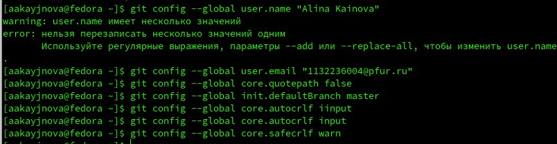
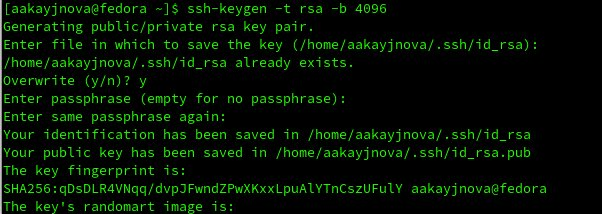
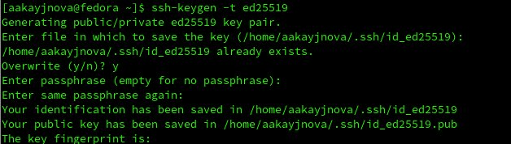
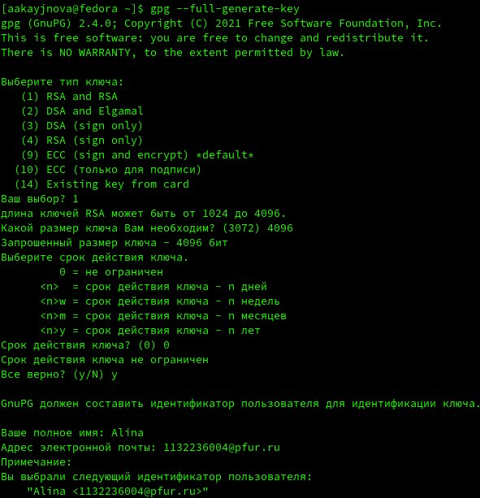
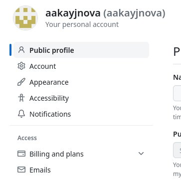
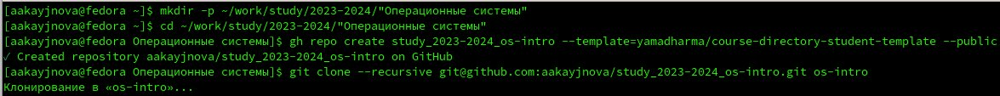
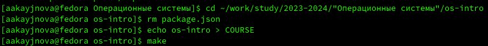
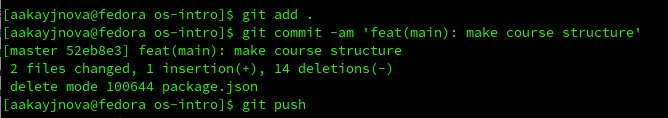

---
## Front matter
lang: ru-RU
title: Лабораторная работа №2
subtitle: Операционные системы
author:
  - Кайнова А. А.
institute:
  - Российский университет дружбы народов, Москва, Россия
date: 29 февраля 2024

## i18n babel
babel-lang: russian
babel-otherlangs: english

## Formatting pdf
toc: false
toc-title: Содержание
slide_level: 2
aspectratio: 169
section-titles: true
theme: metropolis
header-includes:
 - \metroset{progressbar=frametitle,sectionpage=progressbar,numbering=fraction}
 - '\makeatletter'
 - '\beamer@ignorenonframefalse'
 - '\makeatother'
 
---
## Цель работы

Изучить идеологии и применения средств конроля версий, освоить умения по работе с git.

## Задание

1. Создать базовую конфигурацию для работы с git
2. Создать ключ SSH
3. Создать ключ GPG
4. Настроить подписи Git
5. Зарегистрироваться на GitHub
6. Создать локальный каталог для выполнения заданий по предмету.

## Выполнение лабораторной работы. Создание базовой конфигурации для работы с git

Установим git, зададим имя и почту владельца, настроим utf-8 и зададим имя начальной ветки, autocrlf и safecrlf

{#fig:001 width=70%}

## Выполнение лабораторной работы. Создание ключей SSH

Создадим ключ по алгоритму rsa размером 4096 бит 

{#fig:002 width=70%}

Создадим ключ по алгоритму ed25519

{#fig:003 width=70%}

## Выполнение лабораторной работы. Создание ключа PGP

Генерируем ключ и выбираем заданные опции

{#fig:004 width=70%}

## Выполнение лабораторной работы. Настройка подписи git

Указываем Git применять введённый email при подписи коммитов

{#fig:005 width=70%}

## Выполнение лабораторной работы. Регистрация на Github

У меня уже есть аккаунт на Github

{#fig:006 width=70%}

## Выполнение лабораторной работы. Создание локального каталога для выполнения заданий по предмету

Создадим шаблон рабочего пространства

{#fig:007 width=70%}

Настроим каталог курса

{#fig:008 width=70%}

Отправим файлы на сервер

{#fig:009 width=70%}

## Выводы

В ходе данной лабораторной работы мы изучили идеологию и применение средств контроля версий и приобрели навыки по работе с git.

## Список литературы{.unnumbered}

::: {#refs}
1. https://esystem.rudn.ru/mod/page/view.php?id=1098790#orgf425532
:::

