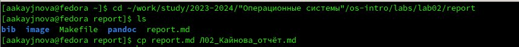
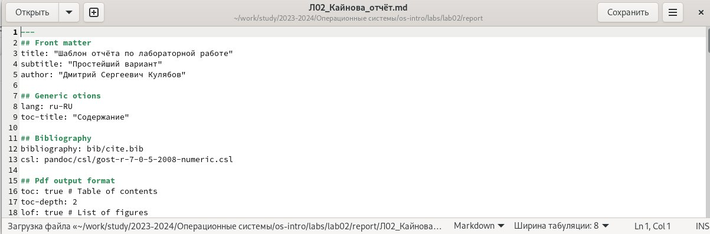
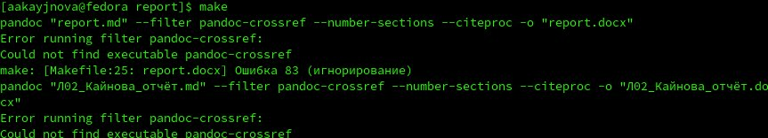

---
## Front matter
lang: ru-RU
title: Лабораторная работа №2
subtitle: Операционные системы
author:
  - Кайнова А. А.
institute:
  - Российский университет дружбы народов, Москва, Россия
date: 02 марта 2024

## i18n babel
babel-lang: russian
babel-otherlangs: english

## Formatting pdf
toc: false
toc-title: Содержание
slide_level: 2
aspectratio: 169
section-titles: true
theme: metropolis
header-includes:
 - \metroset{progressbar=frametitle,sectionpage=progressbar,numbering=fraction}
 - '\makeatletter'
 - '\beamer@ignorenonframefalse'
 - '\makeatother'
---

# Вводная часть

## Цель работы

Научиться оформлять отчёты с помощью легковесного языка разметки Markdown.

## Задание

1. Сделать отчёт по предыдущей лабораторной работе в формате Markdown

## Выполнение лабораторной работы

Переходим в каталог, где хранится шаблон отчёта по лабораторной работе №2 и копируем его с другим именем

{#fig:001 width=70%}

Открываем скопированный файл и начинаем заполнять отчёт по лабораторной работе №2

{#fig:002 width=70%}

## Выполнение лабораторной работы

После компилируем готовый отчёт

{#fig:003 width=70%}

Добавляем файлы 

{#fig:004 width=70%}

Отправляем на сервер

{#fig:005 width=70%}

## Выводы

В ходе данной лабораторной работы мы научились оформлять отчёты в Markdown.

## Список литературы{.unnumbered}

::: {#refs}
1. https://esystem.rudn.ru/pluginfile.php/2288079/mod_resource/content/3/003-lab_markdown.pdf
:::
