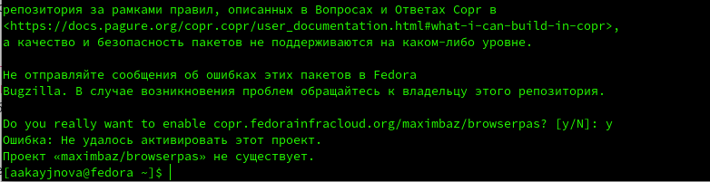
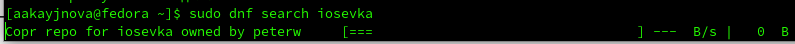
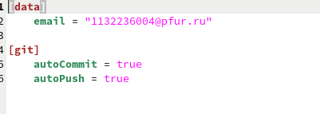

---
## Front matter
lang: ru-RU
title: Лабораторная работа №5
subtitle: Операционные системы
author:
  - Кайнова А. А.
institute:
  - Российский университет дружбы народов, Москва, Россия
date: 16 марта 2024

## i18n babel
babel-lang: russian
babel-otherlangs: english

## Formatting pdf
toc: false
toc-title: Содержание
slide_level: 2
aspectratio: 169
section-titles: true
theme: metropolis
header-includes:
 - \metroset{progressbar=frametitle,sectionpage=progressbar,numbering=fraction}
 - '\makeatletter'
 - '\beamer@ignorenonframefalse'
 - '\makeatother'
---

# Цель работы

Настроить рабочую среду: менеджер паролей pass, установка доп ПО, chezmoi.

# Задание

1. Установить и наcтроить менеджер паролей pass.
2. Установить дополнительное ПО.
3. Установить и настроить chezmoi

# Теоретическое введение

Менеджер паролей pass — программа, сделанная в рамках идеологии Unix. Также носит название стандартного менеджера паролей для Unix (The standard Unix password manager). Данные хранятся в файловой системе в виде каталогов и файлов. Файлы шифруются с помощью GPG-ключа.Структура базы может быть произвольной, если Вы собираетесь использовать её напрямую, без промежуточного программного обеспечения. Тогда семантику структуры базы данных Вы держите в своей голове. Если же необходимо использовать дополнительное программное обеспечение, необходимо семантику заложить в структуру базы паролей.

# Выполнение лабораторной работы

## Установить и настроить менеджер паролей pass 

Установим pass 

{#fig:001 width=70%}

Просмотрим список ключей gpg

{#fig:002 width=70%}

## Установить и настроить менеджер паролей pass

Инициализируем хранилище 

{#fig:003 width=70%}

Создадим структуру git 

{#fig:004 width=70%}

## Установить и настроить менеджер паролей pass 

Зададим адрес репозитория на хостинге

{#fig:005 width=70%}

Проверим статус синхронизации

{#fig:006 width=70%}

## Установить и настроить менеджер паролей pass 

Установи плагин browserpass для Firefox

{#fig:007 width=70%}

Подключиться к репозиторию для установки интерфейса для взаимодейтвия с броузером не удалось.

{#fig:008 width=70%}

Соответственно, не удалось установить и browserpass.

{#fig:009 width=70%}

Поэтому мне пришлось устанавливать интерфейс для browserpass с помощью сторонних ресурсов.

## Установить и настроить менеджер паролей pass 

Добавим новый пароль

{#fig:0010 width=70%}

Отобразим созданный пароль

{#fig:0011 width=70%}

## Установить и настроить менеджер паролей pass 

Заменим существующий пароль на рандомно сгенерированный и отобразим его

{#fig:0012 width=70%}

## Установить допольнительное ПО

Установим dunst

{#fig:0013 width=70%}

Установим fontawesome-fonts

{#fig:0014 width=70%}

## Установить допольнительное ПО

Установим powerline-fonts

{#fig:0015 width=70%}

Установим light

{#fig:0016 width=70%}

## Установить допольнительное ПО

Установим fuzzel

{#fig:0017 width=70%}

Установим swaylock

{#fig:0018 width=70%}

## Установить допольнительное ПО

Установим kitty

{#fig:0019 width=70%}

Установим waybar swaybg

{#fig:0020 width=70%}

## Установить допольнительное ПО

Установим wl-clipboard

{#fig:0021 width=70%}

Установим mpv

{#fig:0022 width=70%}

## Установить допольнительное ПО

Установим grim

{#fig:0023 width=70%}

Установим slurp

{#fig:0024 width=70%}

## Установить допольнительное ПО

Подключимся к репозиторию Copr

{#fig:0025 width=70%}

Поиск iosevka

{#fig:0026 width=70%}

Установим заданные шрифты

{#fig:0027 width=70%}

## Установить и настроить chezmoi

Установим бинарный файл для определения архитектуры процессора и скачивания необходимого файла

{#fig:0028 width=70%}

Создадим репозиторий для конфигурационных файлов на основе шаблона

{#fig:0029 width=70%}

## Установить и настроить chezmoi

Инициализируем chezmoi с нашим репозиторием doftiles

{#fig:0030 width=70%}

Проверим изменения, которые внесёт chezmoi в домашний каталог и примем измения

{#fig:0031 width=70%}

## Установить и настроить chezmoi

Получим и применим последние изменения chezmoi

{#fig:0032 width=70%}

Извлечём последние изменения из нашего репозитория и посмотрим, что изменится, не применяя изменений

{#fig:0033 width=70%}

Применим последние изменения

{#fig:0034 width=70%}

## Установить и настроить chezmoi

Откроем файл конфигурации chezmoi.toml

{#fig:0035 width=70%}

У меня изначально всё было true

{#fig:0036 width=70%}

# Выводы

В ходе данной лабораторной работы мы настроили свою рабочую среду для дальнешей работы.

# Список литературы{.unnumbered}

1. https://esystem.rudn.ru/mod/page/view.php?id=1098796

