---
## Front matter
title: "Отчёт по лабораторной работе №6"
subtitle: "Операционные системы"
author: "Кайнова Алина Андреевна"

## Generic otions
lang: ru-RU
toc-title: "Содержание"

## Bibliography
bibliography: bib/cite.bib
csl: pandoc/csl/gost-r-7-0-5-2008-numeric.csl

## Pdf output format
toc: true # Table of contents
toc-depth: 2
lof: true # List of figures
fontsize: 12pt
linestretch: 1.5
papersize: a4
documentclass: scrreprt
## I18n polyglossia
polyglossia-lang:
  name: russian
  options:
	- spelling=modern
	- babelshorthands=true
polyglossia-otherlangs:
  name: english
## I18n babel
babel-lang: russian
babel-otherlangs: english
## Fonts
mainfont: PT Serif
romanfont: PT Serif
sansfont: PT Sans
monofont: PT Mono
mainfontoptions: Ligatures=TeX
romanfontoptions: Ligatures=TeX
sansfontoptions: Ligatures=TeX,Scale=MatchLowercase
monofontoptions: Scale=MatchLowercase,Scale=0.9
## Biblatex
biblatex: true
biblio-style: "gost-numeric"
biblatexoptions:
  - parentracker=true
  - backend=biber
  - hyperref=auto
  - language=auto
  - autolang=other*
  - citestyle=gost-numeric
## Pandoc-crossref LaTeX customization
figureTitle: "Рис."
tableTitle: "Таблица"
lofTitle: "Список иллюстраций"
lolTitle: "Листинги"
## Misc options
indent: true
header-includes:
  - \usepackage{indentfirst}
  - \usepackage{float} # keep figures where there are in the text
  - \floatplacement{figure}{H} # keep figures where there are in the text
---

# Цель работы

Приобрести навыков взаимодействия пользователя с системой посредством командной строки.

# Задание

1. Определить полное имя домашнего каталога
2. Работа в каталоге tmp
3. Работа с домашним каталогом
4. Определить опцию команды ls для полного просмотра содержимого
5. Определить набор опций команды ls для сортировки файлов по времени последнего изменения
6. Использовать команду man для просмотра описания команд: cd, pwd, mkdir, rmdir, rm
7. Используя информацию, полученную с помощью history, выполнить модифицированное исполнение некоторых команд

# Теоретическое введение

В операционной системе типа Linux взаимодействие пользователя с системой обычно осуществляется с помощью командной строки посредством построчного ввода команд. При этом обычно используется командные интерпретаторы языка shell: /bin/sh; /bin/csh; /bin/ksh. Командой в операционной системе называется записанный по специальным правилам текст (возможно с аргументами), представляющий собой указание на выполнение какой-либо функций (или действий) в операционной системе. Обычно первым словом идёт имя команды, остальной текст — аргументы или опции, конкретизирующие действие.Общий формат команд можно представить следующим образом:<имя_команды><разделитель><аргументы> Команда man используется для просмотра (оперативная помощь) в диалоговом режиме руководства (manual) по основным командам операционной системы
типа Linux. Команда cd используется для перемещения по файловой системе операционной системы типа Linux. Для определения абсолютного пути к текущему каталогу используется команда pwd (print working directory. Команда ls используется для просмотра содержимого каталога. Команда mkdir используется для создания каталогов. Команда rm используется для удаления файлов и/или каталогов. Для вывода на экран списка ранее выполненных команд исполь-
зуется команда history. Выводимые на экран команды в списке нумеруются. К любой команде из выведенного на экран списка можно обратиться по её номеру в списке, воспользовавшись конструкцией !<номер_команды>. Если требуется выполнить последовательно несколько команд, записанный в одной строке, то для этого используется символ точка с запятой

# Выполнение лабораторной работы

##  Определить полное имя домашнего каталога

Используем команду pwd для определения полного имени домашнего каталога.

{#fig:001 width=70%}

## Работа в каталоге tmp

Переходим в каталог tmp, выводим на экран его содержимое, используя команду ls с различными опциями.

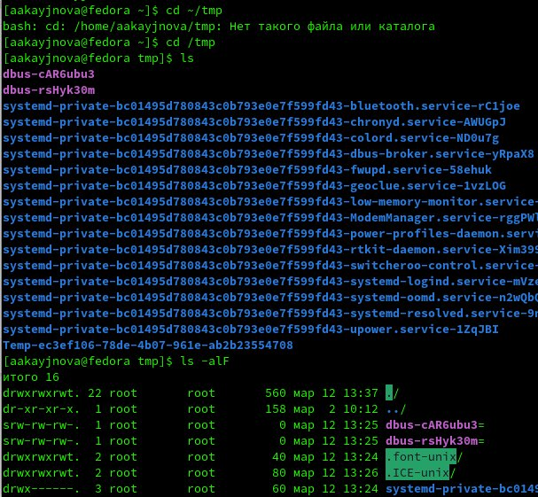{#fig:002 width=70%}

Команда ls выводит список файлов и каталогов, команда ls -alF выводит права доступа, размер, расположение и дату создания каталогов и файлов.

Определим есть ли в каталоге /var/spool подкаталог cron.

{#fig:003 width=70%}

Такого каталога нет.

## Работа с домашним каталогом

Перейдём в домашний каталог и определим владельца(ов) файлов и каталогов.

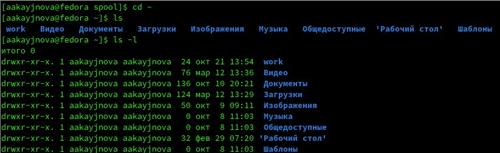{#fig:004 width=70%}

Создадим в домашнем каталоге каталог newdir.

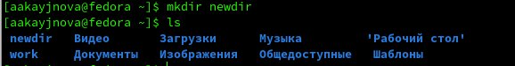{#fig:005 width=70%}

Создадим в этом каталоге каталог morefun.

{#fig:006 width=70%}

В домашнем каталоге одной командой создадим три каталога letter, memos, misk и удалим эти каталоги одной командой.

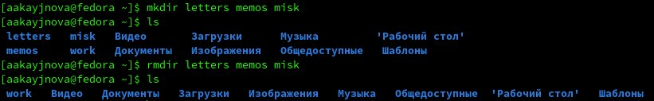{#fig:007 width=70%}

Попробуем удалить ранее созданный каталог newdir командой rm и проверим выполнение команды.

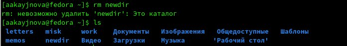{#fig:008 width=70%}

Каталог не удалился.

Удалим каталог morefun из домашнего каталога и проверим выполнение команды.

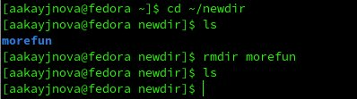{#fig:009 width=70%}

Каталог удлалися.

## Определить опцию команды ls для полного просмотра содержимого

С помощью команды man определим, какую опцию команды ls нужно использовать для полного просмотра содержимого.

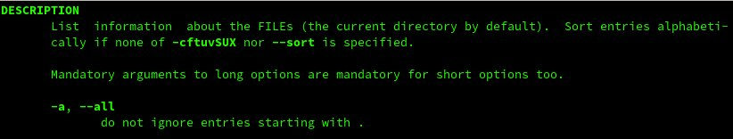{#fig:010 width=70%}

Нужно использовать команду ls -all.

## Определить набор опций команды ls для сортировки файлов по времени последнего изменения

С помощью команды man определим набор опций команды ls, позволяющий отсортировать по времени последнего изменения выводимый список содержимого каталога с развёрнутым описанием файлов.

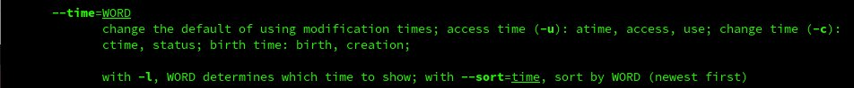{#fig:011 width=70%}

Нужно использовать команду ls -lt.

## Использовать команду man для просмотра описания команд: cd, pwd, mkdir, rmdir, rm

Используем команду man для просмотра описания команды cd.

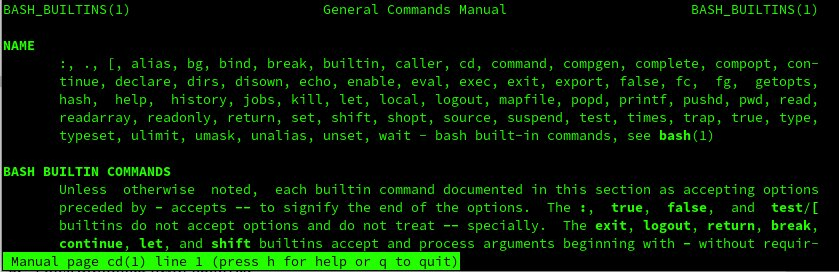{#fig:012 width=70%}

Используется для перехода между директориями.

Используем команду man для просмотра описания команды pwd.

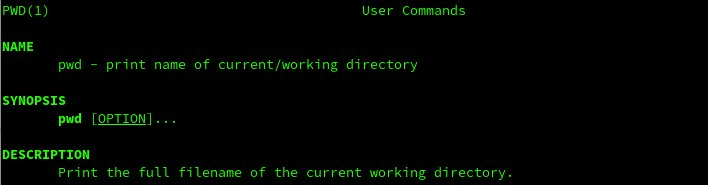{#fig:013 width=70%}

Используется для того, чтобы узнать полное имя файла или каталога(полный путь к ним).

Используем команду man для просмотра описания команды mkdir.

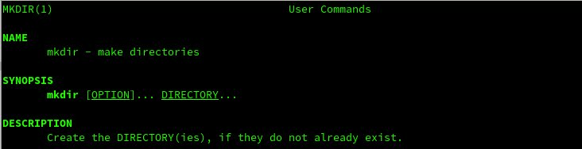{#fig:014 width=70%}

Используется для создания нового(ых) каталога(ов).

Используем команду man для просмотра описания команды rmdir.

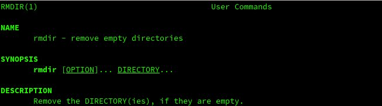{#fig:015 width=70%}

Используется для удалени каталога(ов).

Используем команду man для просмотра описания команды rm.

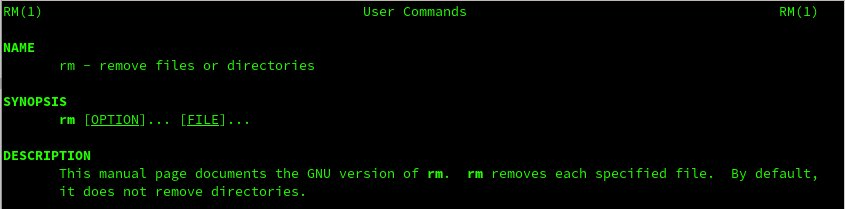{#fig:016 width=70%}

Используется для удаления файла(ов) или каталога(ов).

## Используя информацию, полученную с помощью history, выполнить модифицированное исполнение некоторых команд

Используем команду history для просмотра ранее введённых команд.

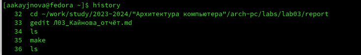{#fig:017 width=70%}

Изменим некоторые команды и исполним их.

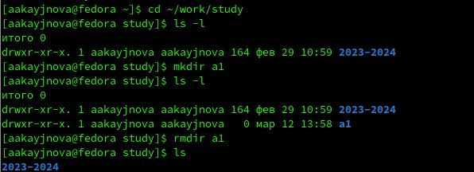{#fig:018 width=70%}

# Выводы

В ходе данной лабораторной работы мы научились работать с командной строкой.

# Список литературы{.unnumbered}

1. file:///home/aakayjnova/%D0%97%D0%B0%D0%B3%D1%80%D1%83%D0%B7%D0%BA%D0%B8/004-lab_shell.pdf
