---
## Front matter
title: "Отчёт по лабораторной работе №7"
subtitle: "Операционные системы"
author: "Кайнова Алина Андреевна"

## Generic otions
lang: ru-RU
toc-title: "Содержание"

## Bibliography
bibliography: bib/cite.bib
csl: pandoc/csl/gost-r-7-0-5-2008-numeric.csl

## Pdf output format
toc: true # Table of contents
toc-depth: 2
lof: true # List of figures
fontsize: 12pt
linestretch: 1.5
papersize: a4
documentclass: scrreprt
## I18n polyglossia
polyglossia-lang:
  name: russian
  options:
	- spelling=modern
	- babelshorthands=true
polyglossia-otherlangs:
  name: english
## I18n babel
babel-lang: russian
babel-otherlangs: english
## Fonts
mainfont: PT Serif
romanfont: PT Serif
sansfont: PT Sans
monofont: PT Mono
mainfontoptions: Ligatures=TeX
romanfontoptions: Ligatures=TeX
sansfontoptions: Ligatures=TeX,Scale=MatchLowercase
monofontoptions: Scale=MatchLowercase,Scale=0.9
## Biblatex
biblatex: true
biblio-style: "gost-numeric"
biblatexoptions:
  - parentracker=true
  - backend=biber
  - hyperref=auto
  - language=auto
  - autolang=other*
  - citestyle=gost-numeric
## Pandoc-crossref LaTeX customization
figureTitle: "Рис."
listingTitle: "Листинг"
lofTitle: "Список иллюстраций"
lolTitle: "Листинги"
## Misc options
indent: true
header-includes:
  - \usepackage{indentfirst}
  - \usepackage{float} # keep figures where there are in the text
  - \floatplacement{figure}{H} # keep figures where there are in the text
---

# Цель работы

Приобрести навыки по работе с файловой системой Linux.

# Задание

1. Выполнить все примеры, приведённые в первой части работы
2. Выполнить некоторые действия, указав в отчёте используемые команды
3. Определить опции команды chmod
4. Проделать приведённые ниже упражнения
5. Прочитать man по командам и кратко их охарактеризовать

# Теоретическое введение

Для создания текстового файла можно использовать команду touch. Для просмотра файлов небольшого размера можно использовать команду cat. Для просмотра файлов постранично удобнее использовать команду less. Команда head выводит по умолчанию первые 10 строк файла. Команда tail выводит умолчанию 10 последних строк файла. Команда cp используется для копирования файлов и каталогов. Команды mv и mvdir предназначены для перемещения и переименования файлов
и каталогов.

# Выполнение лабораторной работы

## Выполнить все примеры, приведённые в первой части работы

Скопируем файл ~/abc1 в файл april и в файл may

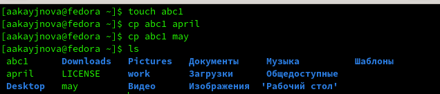{#fig:001 width=70%}

Скопируем файлы april и may в каталог monthly

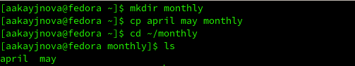{#fig:002 width=70%}

Скопируем файл monthly/may в файл с именем june

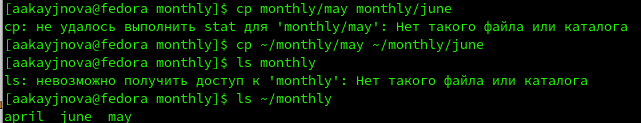{#fig:003 width=70%}

Скопируем каталог monthly в каталог monthly.00 и каталог monthly.00 в каталог /tmp

{#fig:004 width=70%}

Изменим название файла april на july

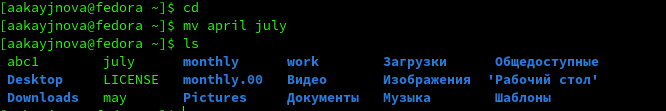{#fig:005 width=70%}

Переместим файл july в каталог monthly.00

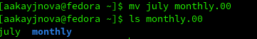{#fig:006 width=70%}

Переименуем каталог monthly.00 в monthly.01

{#fig:007 width=70%}

Переместим каталог monthly.01 в каталог reports

{#fig:008 width=70%}

Переименуем каталог monthly.01 в monthly

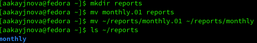{#fig:009 width=70%}

Создадим файл ~/may с правом выполнения для владельца

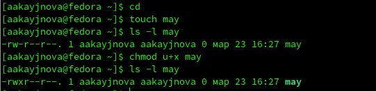{#fig:010 width=70%}

Лишим владельца прав на выполнение

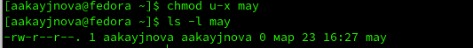{#fig:011 width=70%}

Создадим каталог monthly с запретом на чтение для членов группы и всех остальных пользователей

{#fig:012 width=70%}

У меня не работает chmod с каталогами.

Создадим файл ~/abc1 с правом записи для членов группы

{#fig:013 width=70%}

## Выполнить некоторые действия, указав в отчёте используемые команды

Скопируем файл /usr/include/sys/io.h в домашний каталог и назовём его equipment

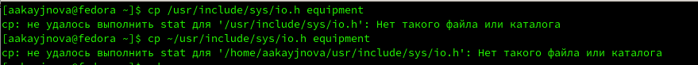{#fig:014 width=70%}

У меня нет такого файла и каталога, поэтому позже я просто создам файл equipment с расширением h

Создадим директорию ~/ski.plases

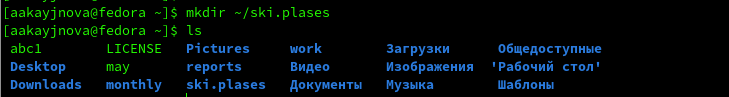{#fig:015 width=70%}

Переместим файл equipment в каталог ~/ski.plases

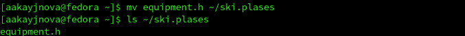{#fig:016 width=70%}

Переименуем файл ~/ski.plases/equipment в ~/ski.plases/equiplist

{#fig:017 width=70%}

Создадим в домашнем каталоге файл abc1 и скопируем его в каталог ~/ski.plases, назовём его equiplist2

{#fig:018 width=70%}

Создадим каталог с именем equipment в каталоге ~/ski.plases

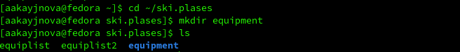{#fig:019 width=70%}

Переместим файла ~/ski.plases/equiplist и equiplist2 в каталог ~/ski.plases/equipment

{#fig:020 width=70%}

Создадим и переместим каталог ~/newdir в каталог ~/ski.plases и назовём его plans

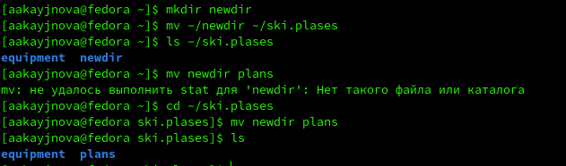{#fig:021 width=70%}

## Определить опции команды chmod

Присвоим права доступа drwxr--r-- каталогу australia

{#fig:022 width=70%}

К сожалению, у меня не работает chmod с каталогами.

Присвоим права доступа drwx--x--x каталогу play

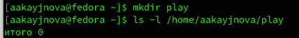{#fig:023 width=70%}

К сожалению, у меня не работает chmod с каталогами.

Присвоим права доступа -r-xr--r-- файлу my_os

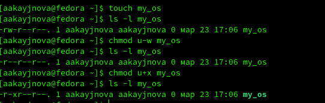{#fig:024 width=70%}

Присвоим права доступа -rw-rw-r-- файлу feathers

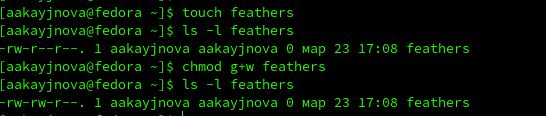{#fig:025 width=70%}

## Проделать приведённые ниже упражнения

Просмотрим содержимое файла /etc/password с помощью команды ls

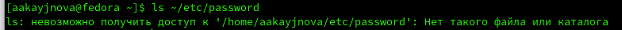{#fig:026 width=70%}

Скопируем файл ~/feathers в файл ~/file.old с помощью команды cp

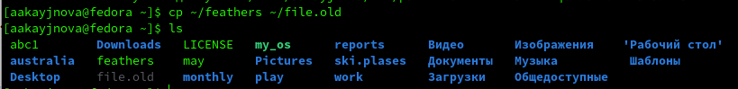{#fig:027 width=70%}

Переместим файл ~/file.old в каталог ~/play с помощью команды mv

{#fig:028 width=70%}

Скопируем каталог ~/play в каталог ~/fun с помощью команды cp

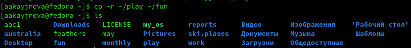{#fig:029 width=70%}

Переместим каталог ~/fun в каталог ~/play и назовём его games с помощью команды mv

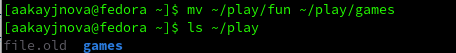{#fig:030 width=70%}

Лишим ладельца файла ~/feathers права на чтение с помощью команды chmod

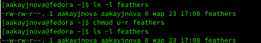{#fig:031 width=70%}

Попытаемся просмотреть файл ~/feathers командой cat

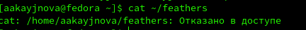{#fig:032 width=70%}

Мы не сможем его просмотреть, т. к. у нас нет прав 

Попытаемся скопировать файл ~/feathers с помощью команды cp

{#fig:033 width=70%}

Мы не можем его скопировать, у нас нет прав 

Выдадим владельцу файла ~/feathers право на чтение

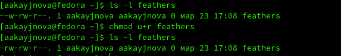{#fig:034 width=70%}

Я не могу использовать команду chmod для каталогов.

## Прочитать man по командам и кратко их охарактеризовать

Man по команде mount

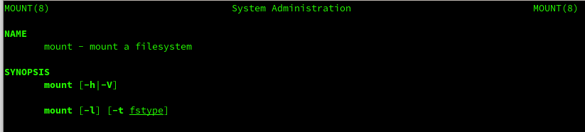{#fig:035 width=70%}

Команда mount позволяет пользователям присоединять дополнительную файловую систему к определённой точке монтирования

Man по команде fsck

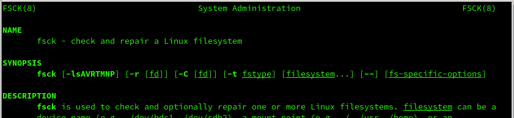{#fig:036 width=70%}

Это утилита для проверки и восстановления файловых систем 

Man по команде mkfs

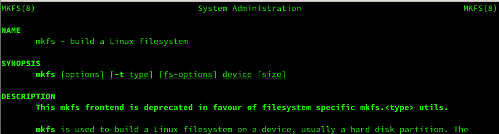{#fig:037 width=70%}

Команда mkfs используется для создания файловой системы на блочном устройстве, таком как жесткий диск или флэш-накопитель

Man по команде kill

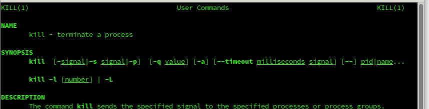{#fig:038 width=70%}

Она позволяет прекратить выполнение запущенных процессов

# Выводы

В ходе данной лабораторной работы мы научились работать с файловой структурой Linux 

# Список литературы{.unnumbered}

1. https://esystem.rudn.ru/pluginfile.php/2288087/mod_resource/content/4/005-lab_files.pdf
